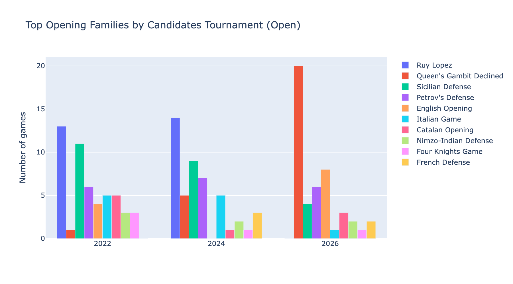
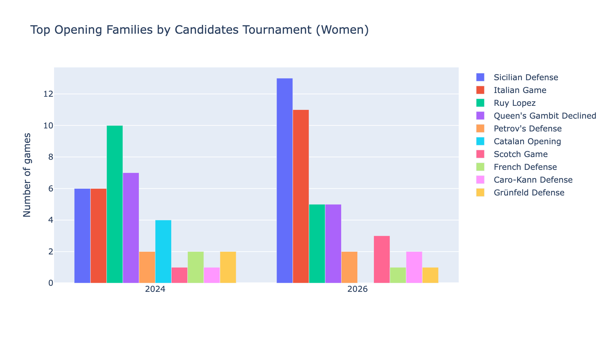
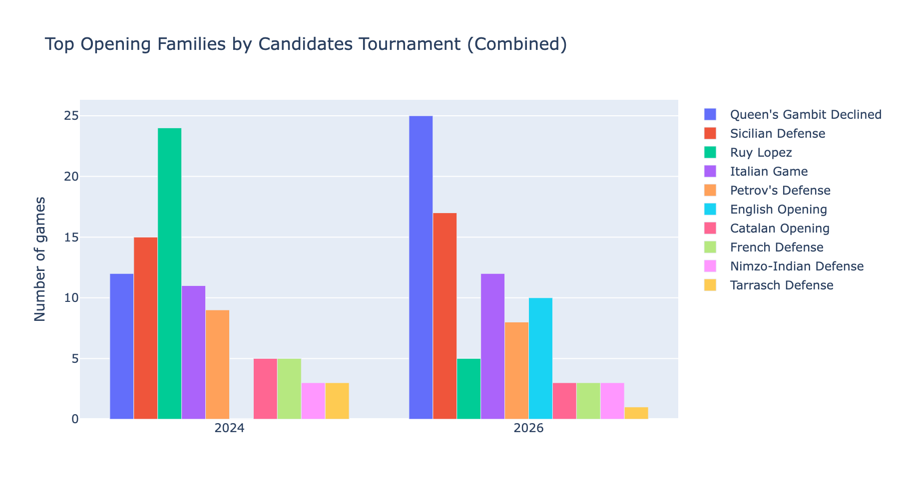

# Opening Distribution in the FIDE Candidates Tournament

Analysis of opening choices across recent FIDE Candidates Tournaments, using game data from [Lichess broadcasts](https://lichess.org/broadcast).

Games are grouped into "opening families" by taking the name before the first colon in the Lichess opening annotation (e.g. "Ruy Lopez: Berlin Defense, Anti-Berlin Variation" becomes "Ruy Lopez").

## Open Section (2022, 2024, 2026)

168 games across three tournaments. Each tournament is an 8-player double round-robin (14 rounds, 4 games per round).



The Ruy Lopez dominated in 2022 and 2024 but disappeared entirely in 2026, replaced by a surge in Queen's Gambit Declined. The Sicilian has been on a steady decline. Petrov's Defense remains a consistent choice across all three years.

## Women's Section (2024, 2026)

112 games across two tournaments. The 2022 Women's Candidates used a knockout format rather than a round-robin, so it is not included.



## Combined (Open + Women, 2024 & 2026)

224 games. Only 2024 and 2026 are included since those are the years where both sections used the same round-robin format.



## Data Source

All game data is fetched live from the [Lichess Broadcast API](https://lichess.org/api#tag/Broadcasts). The Jupyter notebook `candidates_openings.ipynb` contains the full data pipeline and interactive Plotly charts.

## Running

```
uv run jupyter lab
```
